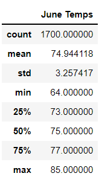
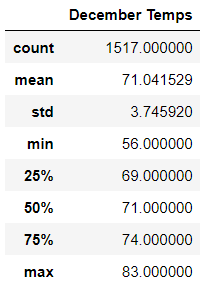

# surfs_up
Wk9 

## Overview of the analysis: 
### W. Avy likes your analysis, but he wants more information about temperature trends before opening the surf shop. Specifically, he wants temperature data for the months of June and December in Oahu, in order to determine if the surf and ice cream shop business is sustainable year-round.
## Results: Provide a bulleted list with three major points from the two analysis deliverables. Use images as support where needed.
There is a bulleted list that addresses the three key differences in weather between June and December. (6 pt)

## Summary: Provide a high-level summary of the results and two additional queries that you would perform to gather more weather data for June and December.
There is a high-level summary of the results and there are two additional queries to perform to gather more weather data for June and December. (5 pt)

